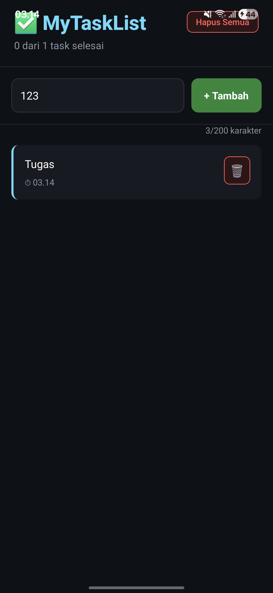

MyTaskList App

Nama: Muhammad Raihan Faturrahman
NIM: 243303621241

Deskripsi Aplikasi

MyTaskList App adalah aplikasi sederhana berbasis React Native yang digunakan untuk mencatat dan mengelola daftar tugas harian. Aplikasi ini memungkinkan pengguna untuk menambahkan, menandai sebagai selesai, dan menghapus task dengan tampilan yang modern dan interaktif.

Fitur yang Diimplementasikan

- Tambah task baru (Add)
- Hapus task (Delete)
- Hapus semua task (Clear All)
- Tandai task selesai (Mark as Done)
- Counter jumlah task selesai
- Validasi input (tidak boleh kosong)
- Character counter (maks 200 karakter)
- Tampilan empty state saat tidak ada data
- UI responsif dengan Flexbox
- KeyboardAvoidingView untuk UX lebih baik

Screenshot Aplikasi

Cara Menjalankan Project

1. Install dependencies:
npm install

2. Jalankan project:
npx expo start

3. Scan QR code menggunakan aplikasi Expo Go di HP kamu

Tools yang Digunakan
- React Native (Expo)
- VS Code
- Expo Go
